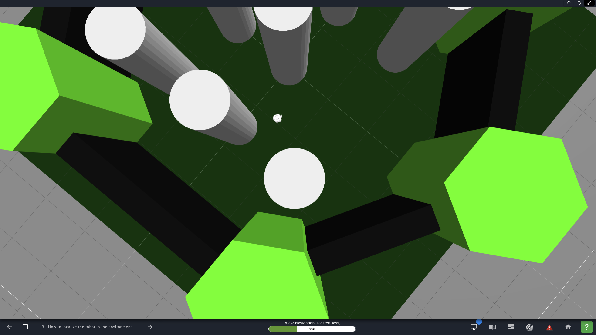
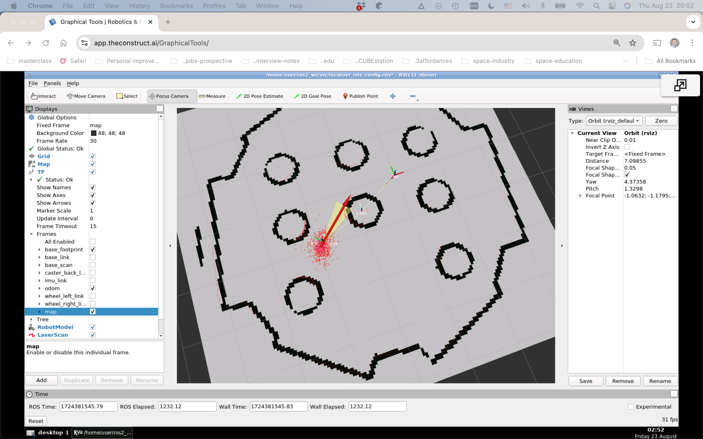
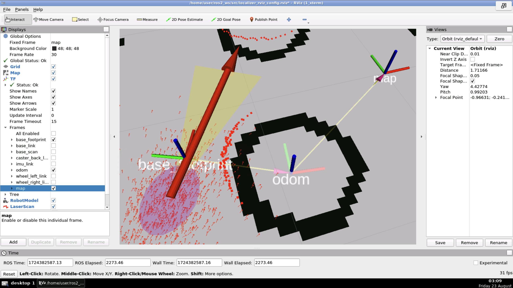
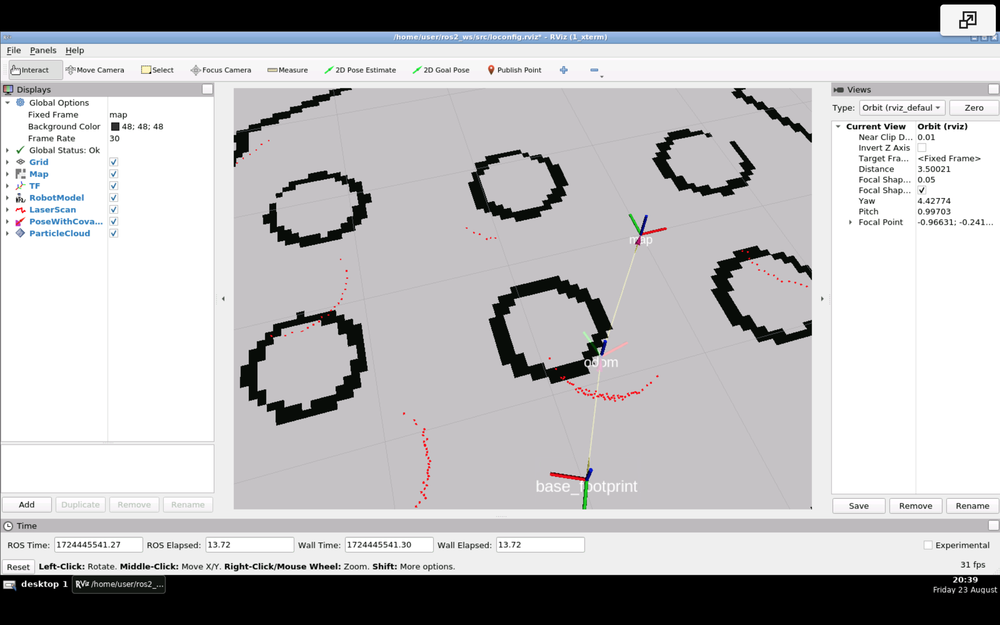

### `localization_server`

#### Notes

1. The node which publishes the `map`->`odom` tranform this time is `amcl`, but _only after_ the **2D Pose Estimate** is selected. Note that this can be very inaccurate at first, but as the robot moves around, it will become increasingly accurate.
   | Gazebo (actual) | Rviz2 (probabilistic) | Detail |
   | --- | --- | --- |
   |  |  |  | 
2. AMCL stands for [**A**daptive **M**onte **C**arlo **L**ocalization](https://roboticsknowledgebase.com/wiki/state-estimation/adaptive-monte-carlo-localization/). Essentially, adaptive _particle filters_. 

#### Initial location

##### 1. Rviz 

With the **2D Pose Estimate** function. The estimated pose is reported as follows:
```
[INFO] [1724444325.415770770] [rviz2]: Setting estimate pose: Frame:map, Position(-0.921304, -1.54146, 0), Orientation(0, 0, 0.973229, 0.229838) = Angle: 2.67777
```  
Note:
1. Frame: map.
2. Position: Vector3 (x, y, z).
3. Oriantation: Quaternion (x, y, z, w).
4. Yaw angle.  

  


##### 2. Config file

Note:  
1. The `amcl` node reports setting it: 
   `[amcl-2] [INFO] [1724445452.744257169] [amcl]: Setting pose (3127.998000): -0.921 -1.541 2.678`  

  


##### 3. Command line

1. `ros2 topic echo /clicked_point`.
2. In Rviz2, click **Publish Point**, the point will be published to the `/clicked_point` topic.
3. Publish to the `/initialpoint` topic published by `amcl` as follows, optionally populating with the echoed data:
   ```
   ros2 topic pub -1 /initialpose geometry_msgs/msg/PoseWithCovarianceStamped "{header: {stamp: {sec: 0}, frame_id: 'map'}, pose: {pose: {position: {x: 0.2, y: 0.0, z: 0.0}, orientation: {w: 1.0}}}}"
   ```

##### 4. Programmatically

1. Write a Python file for a node with a subscriber to `/clicked_point` and a publisher to `/initialpoint`.
2. Put it under the `localization_server` Python package (`__init__.py`), that is, in `localization_server/localization_server`.
3. Add a line to `entry_points`, for example:
   ```
    entry_points={
        'console_scripts': [
                'initial_pose_pub = localization_server.initial_pose_pub:main', # Note: No .py!      
        ],
    },
   ```
4. This is an interactive solution. When the node is running, selecting a point with **Publish Point** will populate the initial pose.


#### Global localization
